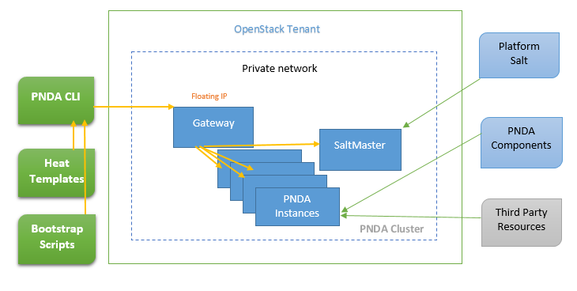

# Creating PNDA on Openstack
The PNDA CLI is able to create PNDA on Openstack. 
Please refer [PNDA Guide on Openstack](https://github.com/pndaproject/pnda-guide/blob/master/provisioning/openstack/PREPARE.md) for pre-requisites.

# Overview



- Heat templates are used to create the instances and other cloud infrastructure in Openstack.
- PNDA is launched in a private network in a openstack tenant/project. For security reasons all access is then controlled via a gateway node, the only one with a public IP address. The CLI generates some sample ssh configuration files to help with accessing the cluster via the gateway.
- The instances are bootstrapped to install the saltstack provisioning system.
- The platform-salt salt scripts are used to install PNDA from PNDA components and third-party components.

# Steps to provision PNDA on OpenStack

1. Clone this pnda-cli repository from the master branch at a specific release tag e.g. `release/x.x`.

2. Copy ```pnda_env_example.yaml``` to create ```pnda_env.yaml```

3. Edit pnda_env.yaml and set `infrastructure.INFRASTRUCTURE_TYPE: openstack`.

4. Edit pnda_env.yaml with a CentOS or Redhat Enterprise Linux 7 image ID (`openstack_parameters.imageId`). This image should be available through OpenStack Image Service. If using a CentOS image set `infrastructure.OS_USER` to "centos"; for a Redhat image set `infrastructure.OS_USER` to "cloud-user".

5. Edit pnda_env.yaml with Openstack credentials under section `openstack_parameters` .

6. Edit pnda_env.yaml and set `openstack_parameters.externalPublicNetworkId` with ID of network which provides FloatingIP.

7. Edit pnda_env.yaml with a version of platform-salt to use. Platform-salt installs PNDA software on the cloud instances created by the PNDA CLI. There are two main options:
   - A local copy of platform-salt can be used by setting (`platform_salt.PLATFORM_SALT_LOCAL`) to the path to the platform-salt folder on the local machine running pnda-cli.py.
   - A remote git URI to be cloned from the cloud during provisioning (`platform_salt.PLATFORM_GIT_REPO_URI` and `platform_salt.PLATFORM_GIT_BRANCH`). If authenticated access to `platform_salt.PLATFORM_GIT_REPO_URI` is required, then place the ssh key to use, named git.pem, in the top level directory of this repository and also set `platform_salt.PLATFORM_GIT_REPO_HOST` to the hostname of the server.
   - **Note** Please ensure that the local clone of platform-salt or the `PLATFORM_GIT_BRANCH` corresponds to the same release/x.x.x tag that this pnda-cli repository was cloned at.

8. Edit pnda_env.yaml and set `pnda_application_repo.PR_FS_TYPE: swift` and names of the swift containers to use for PNDA applications (`pnda_application_repo.PNDA_APPS_CONTAINER`) and PNDA archived data (`pnda_data_archive.PNDA_ARCHIVE_CONTAINER`).

9. Edit pnda_env.yaml with the PNDA mirror IP address (`mirrors.PNDA_MIRROR`). The PNDA mirror server provides a webserver for the binaries for the pnda components plus all the third party resources. [This documentation contains instructions](https://github.com/pndaproject/pnda/blob/develop/CREATING_PNDA.md) on how to set up a PNDA mirror.

10. Place the private key created at [pre-requisite](https://github.com/pndaproject/pnda-guide/blob/master/provisioning/openstack/PREPARE.md) stage in the root of the pnda-cli directory. Ensure that private key has 0600 permissions.
    For example: if the keypair created in Openstack is of name 'pnda', then a local private key file will be downloaded by name 'pnda.pem'.
    This 'pnda.pem' file must be placed in 'pnda-cli/'.
    The corresponding cli parameter that should be passed is '-s pnda'.

11. Install pip packages required by the CLI 
    ```sh
    cd cli
    sudo pip install -r requirements.txt
    ```
    
12. Create a cluster:
    ```sh
    cd cli
    pnda-cli.py create -e <cluster_name> -s <key_name> -f standard -o 2 -n 3 -k 2 -z 3
    ``` 
    The options shown select the standard flavor, 2 open tsdb instances, 3 hadoop datanodes, 2 kafka brokers, and 3 zookeeper nodes. If you need to operate within quota of 20 instances, then you can reduce this to 1 kafka and 1 zookeeper instance or use the pico flavor.
    ```sh
    pnda-cli.py create -e <cluster_name> -s <key_name> -f standard -o 1 -n 1 -k 1 -z 1
    pnda-cli.py create -e <cluster_name> -s <key_name> -f pico -n 1 -k 1
    ```
